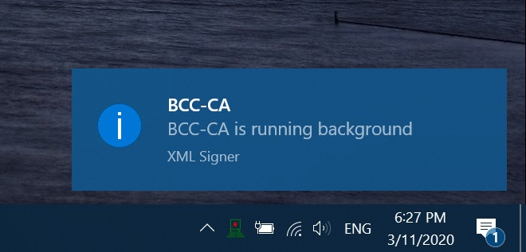
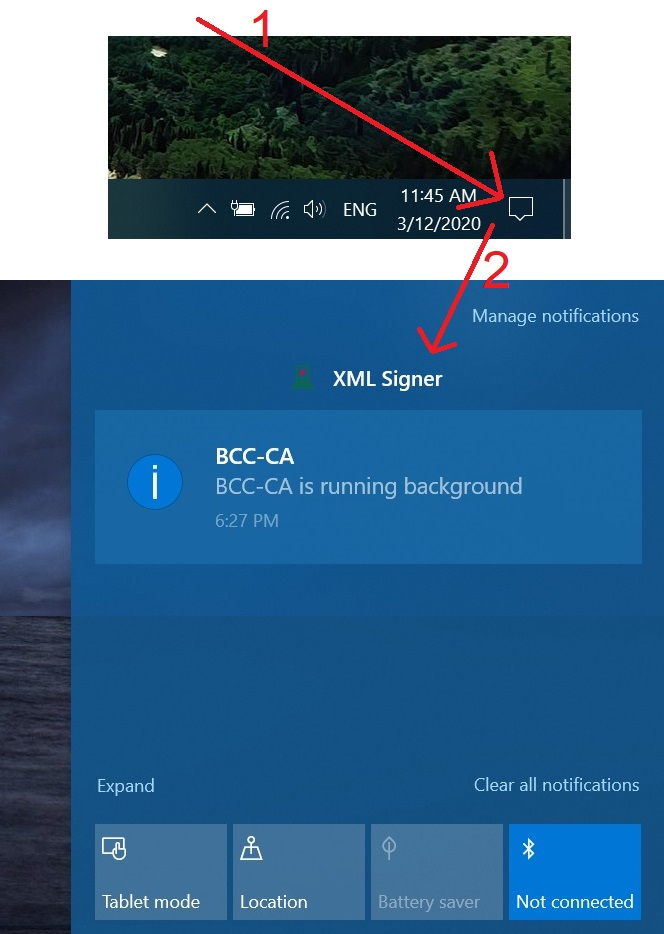
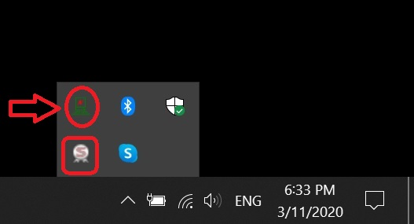
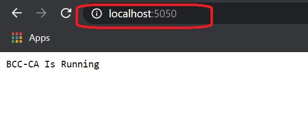

# XML Signing Desktop Client

This is a Desktop client software builld on behalf of [Bangladesh Computer Council (**BCC**)](http://bcc.gov.bd/ "BCC Web") for enabling digital signing to any web forms. The client also embade signing time in the web form with help of *[***Windows NTP Server***](https://support.microsoft.com/en-us/help/262680/list-of-the-simple-network-time-protocol-sntp-time-servers-available)*. It checks client PC time with the **NTP Server** and if client PC time is not correct (if at least ***5 min*** difference from the NTP server), it will not allow users to sign the web form.

Other NTP servers can be used from [***this list***](https://gist.github.com/AbrarJahin/5d257ec077843d81f60c0991735c0230).

## Use Case

This client software would be used to enable any website use digital signature with [x.5009 certificate](https://en.wikipedia.org/wiki/X.509 "x509 Certificate - Wikipedia").
This client software is a ***cross-site desktop client*** for any website having maintain the described API in this document and call the API in the [mentioned way](#mentioned_way).

## How it Works

This desktop client downloads a XML file, sign the file and upload the file with token based authintication.
The files never stored in disk, it just downloaded as [**bytes**](https://stackoverflow.com/questions/4019837/what-do-we-mean-by-byte-array), stored on RAM for processing (signing the downloaded *file bytes*), after being processed, it is uploaded to server.
The web application, using/invoking this app, should provide a file download URL, and file upload url along with parameters through API.
It is recommanded the file download and upload URL should be short time expired enabled (may be, around 5-10 minuites later, liks should be expired) and secured with token authintication. It is also recommanded that the url should be expired after xml file upload completed.

Demo web app for enabling digital signing in a site-

- [ASP.Net Core](https://github.com/AbrarJahin/XML-Signer-ASP.NetCore-PostGRE "ASP.Net Core Server Example")
- PHP Laravel (*demo coming soon*)
- Java Spring (*demo coming soon*)
- Python Django (*demo coming soon*)

## Installation and Deployment

To use the functionality, the desktop client app should be running in client PC (PC wher the website is browsed with browser), so that the app can be invoked/called from any website via javascript [AJAX call](#AJAX-call) as the client app creates a http server in the client PC by running the app.
As previously mentioned, to enable digital form signing, 2 things are needed-

1. Desktop Client App running in the PC (desktop/laptop)
2. Server having the 2 mentioned API to upload and download file and initiate AJAX call from web page

The server should also be capable of creating xml file from server and retrive data from xml and parse the signed xml file so that the server can easily understand who, when, why sign a file.

## API List Needed in Server

The client app needs 2 api enabled in server to work.

1. **Get API** - to download the XML file from server
2. **Post API** - to upload the XML file to server

## Why XML-

We are using XML because-
- Easy to store any data to xml.
- Easy to extract any data from XML and store it to required data format.
- Xml have standerd way of [signing](https://en.wikipedia.org/wiki/XML_Signature "XML Signature wikipedia"), sign verification, 
- Freedom of storing data in any structure in XML

## XML Serialization and Deserialization

Xml serialization and deserialization is needed for storing data in XML for enabling signing and deserialization is needed for retriving data from signed/unsigned XML.
So, serialization and deserialization is completely up to the server, how the data they they would store and how they would read the data. For example, say I have a data like this-

| Poperty Name       | Value                         |
|--------------------|-------------------------------|
| Id                 | 16                            |
| CreateTime         | null                          |
| LastUpdateTime     | null                          |
| DeletionTime       | null                          |
| ApplicantId        | 2                             |
| Name               | Abrar Jahin                   |
| Designation        | IT Specialist                 |
| LeaveStart         | 2020-03-06T00:00:00           |
| LeaveEnd           | 2020-03-07T00:00:00           |
| LeaveType          | Annual                        |
| PurposeOfLeave     | Personal Leave for going home |
| AddressDuringLeave | Pabla, Daulatpur, Khulna      |
| PhoneNoDuringLeave | 12312312312                   |
| ApplicationStatus  | 01822804636                   |
| LastSignedId       | null                          |

I can store data like this-

```xml
<LeaveApplication xmlns:xsi="http://www.w3.org/2001/XMLSchema-instance" xmlns:xsd="http://www.w3.org/2001/XMLSchema">
	<Id>16</Id>
    <CreateTime xsi:nil="true"/>
    <LastUpdateTime xsi:nil="true"/>
    <DeletionTime xsi:nil="true"/>
    <ApplicantId>2</ApplicantId>
    <Name>Abrar Jahin</Name>
    <Designation>IT Specialist</Designation>
    <LeaveStart>2020-03-06T00:00:00</LeaveStart>
    <LeaveEnd>2020-03-07T00:00:00</LeaveEnd>
    <LeaveType>Annual</LeaveType>
    <PurposeOfLeave>Personal Leave for going home</PurposeOfLeave>
    <AddressDuringLeave>Pabla, Daulatpur, Khulna</AddressDuringLeave>
    <PhoneNoDuringLeave>01822804636</PhoneNoDuringLeave>
    <ApplicationStatus>Applied</ApplicationStatus>
    <LastSignedId xsi:nil="true"/>
</LeaveApplication>
```

And for this XML, signed XML (what would be uoloaded by desktop client) would be like this-

```xml
<?xml version="1.0" encoding="UTF-8"?>
<LeaveApplication xmlns:xsd="http://www.w3.org/2001/XMLSchema" xmlns:xsi="http://www.w3.org/2001/XMLSchema-instance">
    <Id>16</Id>
    <CreateTime xsi:nil="true" />
    <LastUpdateTime xsi:nil="true" />
    <DeletionTime xsi:nil="true" />
    <ApplicantId>2</ApplicantId>
    <Name>Abrar Jahin</Name>
    <Designation>IT Specialist</Designation>
    <LeaveStart>2020-03-06T00:00:00</LeaveStart>
    <LeaveEnd>2020-03-07T00:00:00</LeaveEnd>
    <LeaveType>Annual</LeaveType>
    <PurposeOfLeave>Personal Leave for going home</PurposeOfLeave>
    <AddressDuringLeave>Pabla, Daulatpur, Khulna</AddressDuringLeave>
    <PhoneNoDuringLeave>01822804636</PhoneNoDuringLeave>
    <ApplicationStatus>Applied</ApplicationStatus>
    <LastSignedId xsi:nil="true" />
    <Signature xmlns="http://www.w3.org/2000/09/xmldsig#">
        <SignedInfo>
            <CanonicalizationMethod Algorithm="http://www.w3.org/TR/2001/REC-xml-c14n-20010315" />
            <SignatureMethod Algorithm="http://www.w3.org/2001/04/xmldsig-more#rsa-sha256" />
            <Reference Id="My81LzIwMjAgNjoyNjo0OSBBTQ==" URI="">
                <Transforms>
                    <Transform Algorithm="http://www.w3.org/2000/09/xmldsig#enveloped-signature" />
                    <Transform Algorithm="http://www.w3.org/TR/2001/REC-xml-c14n-20010315" />
                </Transforms>
                <DigestMethod Algorithm="http://www.w3.org/2001/04/xmlenc#sha256" />
                <DigestValue>UdvxtfBbHF1P06DSNKAkNqGklsLCuZvyLdSvu4M8L30=</DigestValue>
            </Reference>
        </SignedInfo>
        <SignatureValue>ZyXd1/DgC0DyQA9EIZjCNKKArg5+WVt5ovfFqjrHVFkshPzgFI4239vkx6F4ccyr7SZ+ak4Kewv0z0mZ6hMpeyWpoyI1KLAG2MN5A+hPJBcqeeCnNpTlettzXLp4tXXE+4XfCN/CQjWgKCyyxpLZwgmsXjIExAGsuEsaVGkCo2U8hFiKxNRYpZxNJObOuCaQMlaNhNQrcCPQTJFzYRXMYlyv+93UwGUhISdJrc/Je4DBpW+ni98jxcuxnELk443H1XfenoHy1LXjpzi9Tmi9VlLoFoJdyZQ2LgUIgaSUtXqPjcmnxIWN+JXThXMvxHBzngLOxU3qMFpsBoGDbtfzgA==</SignatureValue>
        <KeyInfo>
            <KeyValue>
                <RSAKeyValue>
                    <Modulus>0OR6rG0LaL4016MSXyWJDMmxIDRUWm0JgRx2kDBUW+2cyQs7y3Bobqu4TdLc2CpvxvAXtHRnaqHIgm1nmdriP1nY2GXG1iJCqAJJeP9cj6FpXPO+RBjzxuARvOIdPlmhKRAUrEf/qhpcyteOHaJoPh0txsiCglOQXu8OLgg4ZspsB2A0Mai3UWOKUYrqvyLfPUdqG4LGIyEOaHswZUVeWXandGfdIzCUh3lNADljD6zD82uyYFOtyQYemjdvWKage5QBuheyQo4tj3sQlPxsuvsrwymNtsWSkZAzUUz3bQqFqbuIod+6UXI42jcuah39gEUxYQjHL4Vy5QZgQVQyBw==</Modulus>
                    <Exponent>AQAB</Exponent>
                </RSAKeyValue>
            </KeyValue>
            <KeyName />
            <X509Data>
                <X509Certificate>MIIFjzCCBHegAwIBAgIQTFbxSBSuyxlmGzsvMoRjsTANBgkqhkiG9w0BAQsFADByMQswCQYDVQQGEwJCRDEkMCIGA1UEChMbQmFuZ2xhZGVzaCBDb21wdXRlciBDb3VuY2lsMQ8wDQYDVQQLEwZTdWItQ0ExLDAqBgNVBAMTI0JDQyBTdWItQ0EgZm9yIENsYXNzIDIgQ2VydGlmaWNhdGVzMB4XDTIwMDEyNjAwMDAwMFoXDTIxMDEyNTIzNTk1OVowgYsxCzAJBgNVBAYTAkJEMREwDwYDVQQKFAhwZXJzb25hbDENMAsGA1UEERQEMTIxNTEOMAwGA1UEBxQFRGhha2ExNDAyBgNVBAUTK05JRGU4NzdiZTk0OWFkZThhMWVkNjE1NmU3N2YzZDJmMTg4ZWRiMzU2NjMxFDASBgNVBAMTC0FicmFyIEphaGluMIIBIjANBgkqhkiG9w0BAQEFAAOCAQ8AMIIBCgKCAQEA0OR6rG0LaL4016MSXyWJDMmxIDRUWm0JgRx2kDBUW+2cyQs7y3Bobqu4TdLc2CpvxvAXtHRnaqHIgm1nmdriP1nY2GXG1iJCqAJJeP9cj6FpXPO+RBjzxuARvOIdPlmhKRAUrEf/qhpcyteOHaJoPh0txsiCglOQXu8OLgg4ZspsB2A0Mai3UWOKUYrqvyLfPUdqG4LGIyEOaHswZUVeWXandGfdIzCUh3lNADljD6zD82uyYFOtyQYemjdvWKage5QBuheyQo4tj3sQlPxsuvsrwymNtsWSkZAzUUz3bQqFqbuIod+6UXI42jcuah39gEUxYQjHL4Vy5QZgQVQyBwIDAQABo4ICBTCCAgEwDAYDVR0TAQH/BAIwADBQBgNVHR8ESTBHMEWgQ6BBhj9odHRwOi8vY3JsLmJjYy1jYS5nb3YuYmQvQkNDQ0FNZWRpdW1QZXJzb25hbEVtYWlsL0xhdGVzdENSTC5jcmwwDgYDVR0PAQH/BAQDAgXgMBMGA1UdJQQMMAoGCCsGAQUFBwMEMB0GA1UdDgQWBBSikVoX3tRKZt6hoQcudOg6tDjdljAfBgNVHSMEGDAWgBQh+716vGk81pDVxAyQp2o1oEvkcjCBjAYDVR0gBIGEMIGBMH8GBWAyAQICMHYwMwYIKwYBBQUHAgEWJ2h0dHA6Ly9wa2kuYmNjLWNhLmdvdi5iZC9yZXBvc2l0b3J5L0NQUzA/BggrBgEFBQcCAjAzGjFDZXJ0aWZpY2F0ZXMgaWRlbnRpZmllZCB0byBNZWRpdW0gQXNzdXJhbmNlIExldmVsMCEGA1UdEQQaMBiBFmFicmFyLmphaGluQGJjYy5nb3YuYmQwdQYIKwYBBQUHAQEEaTBnMCUGCCsGAQUFBzABhhlodHRwOi8vb2NzcC5iY2MtY2EuZ292LmJkMD4GCCsGAQUFBzAChjIiaHR0cDovL3JlcG8uYmNjLWNhLmdvdi5iZC9jZXJ0cy9CQ0NDQS1DbGFzczIuY2VyIjARBglghkgBhvhCAQEEBAMCB4AwDQYJKoZIhvcNAQELBQADggEBAHUn3jMuUp6GxDhTRCO036z2xL1JMk80ogu/FvUsvwIoClWC3etNXlC2vpOeZdcYRyS/3/nKQIqLMcR4thLxLzFL84GT8jPx3AGRTr0fZI1Au4mqdua4BjHCQgy3QwKrtBjO8JWtqkcxKUXTpnMHKtF+IPl4Afa7QcA/FqAaEx7vlYdvRvOOBXIC+dS5ujXS/n379nLAh8VUCfnIjALU95yUdyo+cQhP3W2qQbCSc07TblqXLbi7ENrRz6+0/PwmkuRfWL7nhSM+pFA3kJ5wArviUtFO+YHeD7SCjEZsAKLmuUZo1p55uFBDeQTYNNG0EyvW0bE2WKr4OAyljcAf8kY=</X509Certificate>
            </X509Data>
        </KeyInfo>
        <Object Id="81899570">
            <meta xmlns="meta-data">
                <unique xmlns="unique-id" server-unique="">1</unique>
                <signing-reason xmlns="signing-local-time" local-time="3/5/2020 12:26:49 PM">Anything You Give</signing-reason>
            </meta>
        </Object>
    </Signature>
</LeaveApplication>
```

If any single charecter of the signed XML is changed, the signed XML would not be verified.

Signature verification API is implemented in [**here** for ASP.Net](https://github.com/AbrarJahin/XML-Signer-ASP.NetCore-PostGRE/blob/master/Controllers/api/XmlFilesController.cs#L35). For other languages, implementation would be like that.

The signature contains the *x509 certificate* of the user so that the certificate can be verified easily and we can know who have signed the file along with the status of his certificate at that time. The certificate can be found in the **X509Certificate** tag inside the **Signature** tag.

## Invoking the desktop client to sign the XML File

The desktop client can be invoked (if the client is running) like this-

```javascript
$.ajax({
	crossdomain: true,
	contentType: 'text/plain',
	accepts: 'application/json',
	url: "http://localhost:5050/",              //This URL should not be changed
    type: "POST",                               //This method should not be changed
	dataType: 'jsonp',
	data: {
		id: your_file_id,                       //Will be used to upload file
		token: your_token,                      //Will be used for upload file
		downloadUrl: your_download_url,         //Will be used to download the XML file
		uploadUrl: your_upload_url,             //Will be used for downloading file
		reason: your_reason_for_signing,        //Will be used for storing meta info - used for storing meta info - reason for signing
		procedureSerial: your_process_serial    //Will be used for storing meta info - used for storing meta info - any unique ID regarding to signing
	},
	success: function (data) {
		alert(data);
		console.log(data);
		location.reload();
	},
	error: function (xhr, ajaxOptions, thrownError) {
		console.log(xhr);
		console.log(ajaxOptions);
		console.log(thrownError);
		location.reload();
	}
});
var s = "JavaScript syntax highlighting";
alert(s);
```
If the ajax call is completed and javascript gets status code of 200, that means

## Testing

Client application is created having capablity of running each time windows starts. We can easily know if the application is running or not.
Every time when windows starts, if the application is running in backround, you can see if the desktop client application is running or not by the following ways-

1. When your PC just starts, you will get a notification like this-



2. If you have missed the notification and if the notification is not removed, then you will see the notification in the notification list like this-



3. If the application is running, you will see an icon in the Task-Bar-



4. If the application is running, then if you go to [this link (*localhoost:5050*)](http://localhoost:5050), then you will see this-



if the application is running.

If the application is not running, then you will see something like this-


You can use any option mentioned in above 4 ways to check if desktop client is running or not.

## Architecture

The architecture can be described by the following image-


<!---
<object data="./.doc/architecture.pdf" type="application/pdf" width="700px" height="700px">
    <embed src="./.doc/architecture.jpg">
        <p>This browser does not support PDFs. Please download the PDF to view it: <a href="./.doc/architecture.pdf">Download PDF</a>.</p>
    </embed>
</object>
-->

## Work Flow

